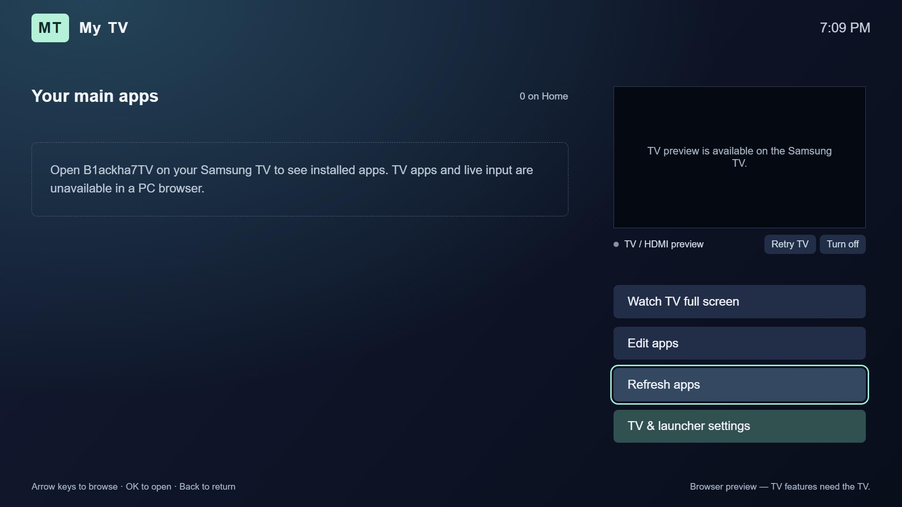

# B1ackha7TV

A remote-friendly, open-source launcher for Samsung Tizen TVs. Choose your main apps, launch them from one screen, and browse alongside a TV/HDMI preview.



## Features

- Installed-app discovery using the public Tizen API, with saved Home shortcuts and an Edit apps catalogue.
- Prime Video and Disney+ duplicate shortcut grouping, native app pictures where accessible, and a bundled Prime Video fallback tile.
- Current TV or HDMI input preview in the upper-right corner, input selection, and full-screen TV shortcut.
- A saved display name and initials badge, editable in Settings (defaults to My TV).
- Three built-in backgrounds, optional locally packaged images, remote navigation, and a Close app dialog.
- Optional system Settings shortcut: discovers a compatible handler first and provides remote instructions when unavailable.

## Compatibility and limits

Developed against a Samsung 2020 TU-series TV running Tizen 5.5. The launcher and the v0.7.1 app-launch repair were confirmed working on that hardware; v0.8.0 adds a display-name setting verified in browser regression tests with simulated TV APIs. Other models and firmware need testing. The SDK API version in the YAML describes the build tooling, not a guarantee of device support.

Only apps returned and launchable through public APIs can appear and open. Some hidden/system apps and icons are inaccessible. The preview uses the tuner or HDMI source retained by the TV; it cannot reproduce a streaming app's picture, and restoring yesterday's channel is controlled by the TV. This app cannot replace Samsung Home or guarantee startup. System Settings support varies by device.

## Install on your own Samsung TV

This repository contains source only. There are no personal certificates, device identifiers, IP addresses, account files, or signed installation packages. Each user must sign with their own certificate and authorize their own TV.

1. Install Samsung's TV development tools: Tizen Studio with the TV and Samsung Certificate extensions, or a compatible Visual Studio Tizen Web setup.
2. Enable Developer Mode on your TV, configure your development computer as the host, restart as required, and connect using Device Manager. Follow [Samsung's TV connection guide](https://developer.samsung.com/smarttv/develop/getting-started/using-sdk/tv-device.html).
3. In Certificate Manager, create your own **Samsung TV** author/distributor certificate profile. Include your own TV's DUID and use Device Manager's installation permission step as required. Keep the author certificate for future updates. See [Samsung's certificate guide](https://developer.samsung.com/smarttv/develop/getting-started/setting-up-sdk/creating-certificates.html).
4. Import the contents of `app/` into a TV Web application project. The public package ID is `B1ackha7TV0`; it is an application identifier, not a TV identifier. Keep your IDE-generated app/package IDs if needed, ensuring both remain consistent in `config.xml`.
5. Select your own signing profile in the IDE. For tooling that uses `tizen_web_project.yaml`, the empty signing profile uses your active local profile. Build, sign, then run on your connected TV.

For Tizen Studio's classic CLI, from the repository root (replace the uppercase placeholders):

```text
tizen build-web -- app
tizen package -t wgt -s YOUR_CERTIFICATE_PROFILE -- app/.buildResult
tizen install -s YOUR_DEVICE_SERIAL --name B1ackha7TV.wgt -- app/.buildResult
tizen run -s YOUR_DEVICE_SERIAL -p B1ackha7TV0.B1ackha7TV
```

Confirm the generated package filename in your build output. Use your own app ID in the run command if you changed the manifest. The YAML/`tz` workflow and classic Tizen Studio CLI are different toolchains; use your installed SDK's workflow. See [Samsung's CLI guide](https://developer.samsung.com/smarttv/develop/getting-started/using-sdk/command-line-interface.html). An update requires the same author certificate; avoid uninstalling if you want to retain preferences.

**Visual Studio:** create a Tizen Web Project with your installed extension and copy `app/` into it. Keep the wrapper and build targets generated by your IDE. This repository intentionally does not distribute machine-specific Visual Studio build targets.

## Controls and customization

Arrow keys move focus, OK opens/selects, Back closes Settings/Edit apps or opens the exit dialog. The blue key opens launcher settings when supported. Home remains controlled by Samsung.

Use **Edit apps** to add/remove Home shortcuts (not uninstall apps). Use **TV & launcher settings → Your launcher name → Save name** to change the heading and initials badge. Names are stored locally, can be up to 32 characters, and can be reset to My TV. This changes the in-app heading; the installed package remains B1ackha7TV. The same panel has themes and connected inputs. For your own background, add a JPG, PNG, or WebP under `app/assets/`, include it in the YAML package list when applicable, rebuild, and enter its `assets/...` path. Custom artwork stays local unless you deliberately commit it. Upgrading from pre-0.7 builds resets the old background once while keeping favorite apps and preview preferences.

## Browser preview and tests

Open `app/index.html` to preview the layout. Real installed apps, live TV, input switching, and app launching require a Samsung TV; the browser does not mirror your TV.

```text
npm install
npx playwright install chromium
npm test
```

Set `BROWSER_CHANNEL=msedge` to test against installed Edge instead. Tests use mocked Tizen APIs and do not certify physical TV behavior. No build step or npm dependency is needed by the TV application itself.

## Privacy, permissions, and contributing

Preferences are kept in the TV's local storage. There is no backend, analytics, or telemetry. Public privileges cover app discovery/launch, TV preview, remote input, and read-only icon access. No partner/platform privileges are requested.

Contributions and model-compatibility reports are welcome. Include the model family, Tizen version, expected behavior and errors, but remove DUIDs, certificates, passwords, network addresses and personal screenshots before posting. Do not commit local signing files or signed packages.

## License and references

Code is MIT licensed; see [LICENSE](LICENSE). Samsung, Tizen, Prime Video, and Disney+ names/marks belong to their owners. This independent project is not endorsed by them. The bundled Prime Video tile is a locally drawn identification fallback, not an official logo asset; trademark rights are not granted by the code license.

- [Application API](https://developer.samsung.com/smarttv/develop/api-references/tizen-web-device-api-references/application-api.html)
- [TVWindow API](https://developer.samsung.com/smarttv/develop/api-references/tizen-web-device-api-references/tvwindow-api.html)
- [Samsung feature restrictions](https://developer.samsung.com/smarttv/develop/faq/other-features.html)
- [Optional standard Settings operation](https://github.com/Samsung/tizen-docs/blob/master/docs/application/web/guides/app-management/common-appcontrols.md#system-settings)
